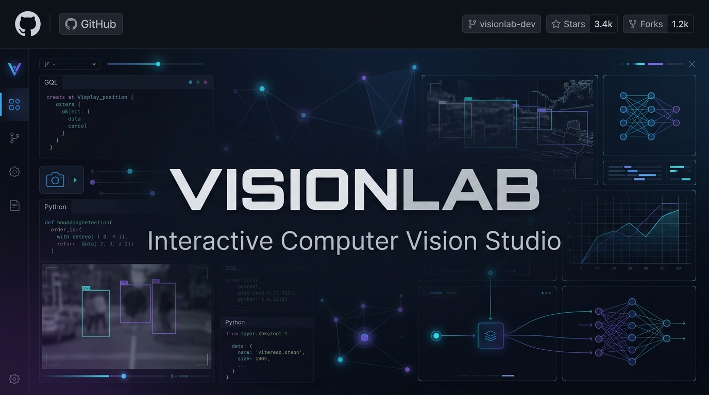
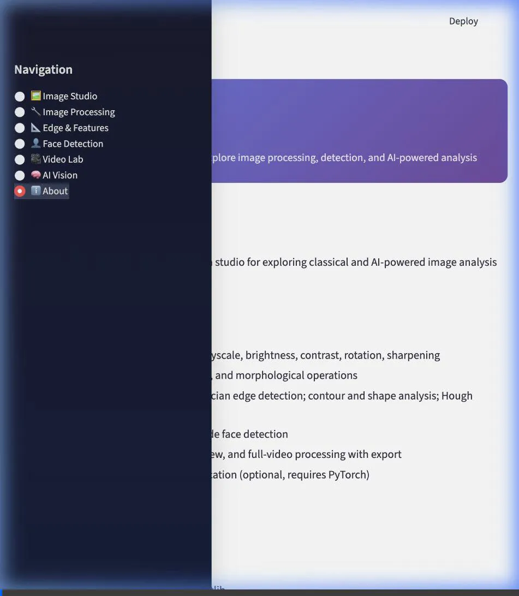
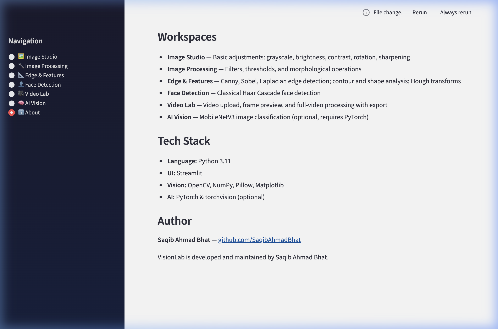
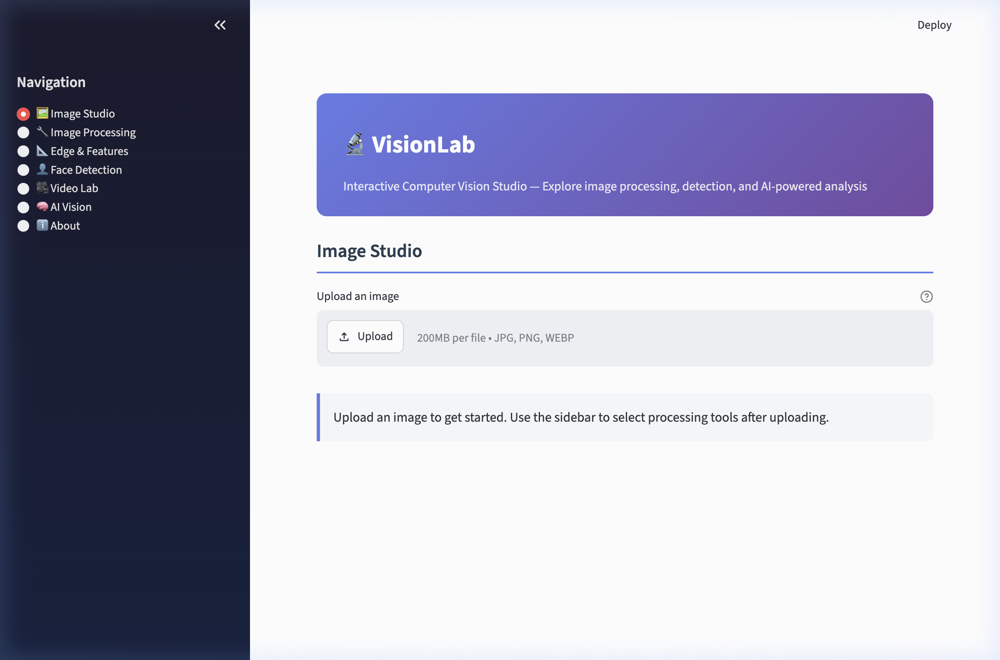
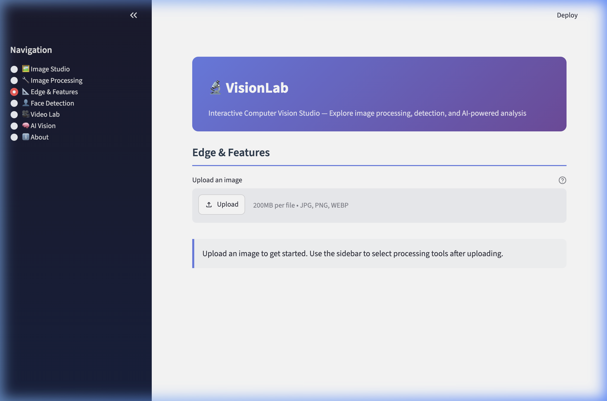
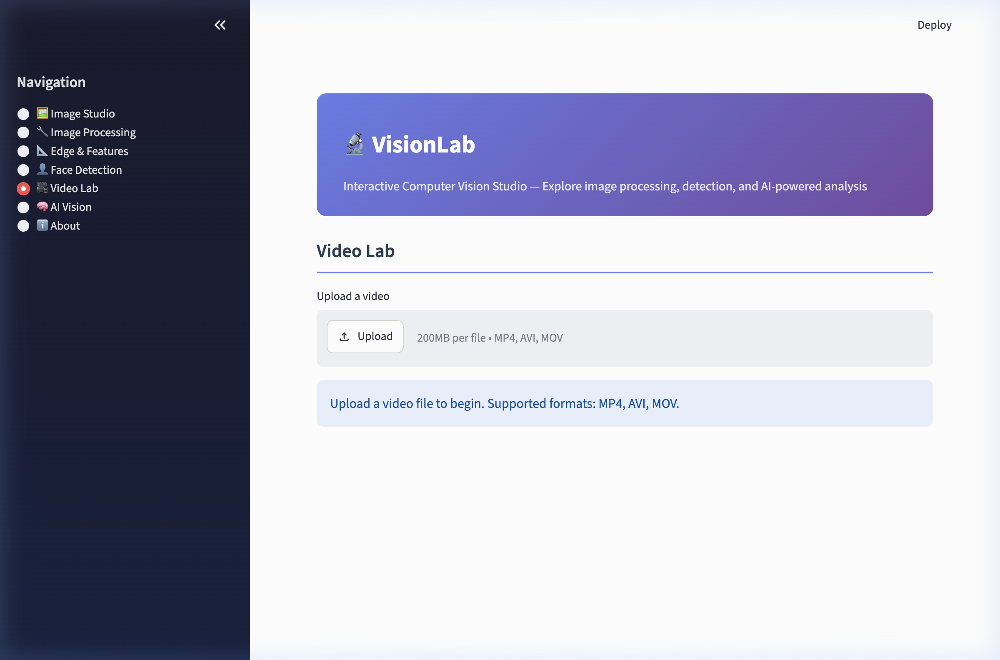

<div align="center">
  

  <h1>VisionLab</h1>
  <p><strong>Interactive Computer Vision Studio</strong></p>

  <p>
    <a href="https://github.com/SaqibAhmadBhat/VisionLab/actions/workflows/tests.yml"></a>
    
    
    
    <a href="LICENSE"></a>
  </p>

  <p>
    An interactive computer vision studio for exploring image processing, feature detection, shape analysis, video processing, and AI-powered visual analysis.
  </p>

  <h3>
    <a href="#demo">Live Demo</a>
    <span> | </span>
    <a href="docs/architecture.md">Architecture</a>
    <span> | </span>
    <a href="#features">Features</a>
  </h3>
</div>

<br>

<div align="center">
  
</div>

---

## 💡 Why VisionLab?

VisionLab was built to bridge the gap between abstract computer vision algorithms and practical, interactive experimentation. Whether you are manipulating spatial frequencies, extracting contours, or running ImageNet classifications, VisionLab provides immediate visual feedback. 

Engineered with a **strictly decoupled architecture**, the core computer vision logic is completely separated from the Streamlit UI layer. This ensures the algorithms are reusable, highly testable (backed by a 50+ test CI suite), and robust enough to handle complex video processing lifecycles without resource leaks.

---

## ✨ Features

VisionLab is organized into focused workspaces, accessible from the sidebar:

*   📸 **Image Studio**: Foundational transformations. Upload images, view metadata, and apply safe RGB/Grayscale conversions, contrast/brightness equalizations, resizing, and rotations.
*   🎛️ **Image Processing**: Apply classical filters (Gaussian, Median, Bilateral, Sharpen) and thresholding techniques (Otsu, Adaptive) to manipulate image frequencies and binarization.
*   📐 **Edge & Features**: Extract structural information using Canny edge detection, Contour/Shape heuristics, and Hough Transforms (Lines & Circles).
*   👤 **Detection**: Utilize Haar Cascades for classical, rapid face detection within varied environments.
*   🎞️ **Video Lab**: Upload video files to extract specific frames, preview streams, and apply full-video processing pipelines with safe, leak-free temporary file handling and MP4 export.
*   🧠 **AI Vision**: If PyTorch is available, run inference using MobileNetV3 (ImageNet) to generate Top-5 classification predictions with softmax confidence bounding.

---

## 🛠️ Tech Stack

The project relies on a minimal, highly optimized stack:

| Category | Technology | Purpose |
| :--- | :--- | :--- |
| **Core Language** | Python 3.11+ | Application backbone |
| **UI Framework** | Streamlit | Interactive web interface and resource caching |
| **Computer Vision** | OpenCV (`opencv-python-headless`) | Matrix operations, filtering, and heuristics |
| **Data / Math** | NumPy, Matplotlib | Array manipulation and specialized plotting |
| **Image I/O** | Pillow (PIL) | Safe file loading and format conversions |
| **AI (Optional)** | PyTorch, Torchvision | MobileNetV3 ImageNet classification |
| **Testing** | Pytest, GitHub Actions | 53-test automated CI validation pipeline |

---

## 🏗️ Architecture

The application implements a clean separation of concerns. The **Application Layer** (`app.py`) handles Streamlit routing, file I/O safety, and model caching. The **Core Vision Layer** (`image_processing.py`, `detection.py`, etc.) consists of pure, framework-independent Python functions that process NumPy arrays.

**[View the detailed Architecture Diagram & Documentation](docs/architecture.md)**

---

## 📸 Gallery

<details>
<summary><b>Click to expand Screenshot Gallery</b></summary>
<br>

| Landing / Upload | Image Studio |
|:---:|:---:|
|  |  |

| Edge & Features | Video Lab |
|:---:|:---:|
|  |  |

</details>

---

## 🚀 Getting Started

### Local Installation

Clone the repository and install the minimal requirements:

```bash
git clone https://github.com/SaqibAhmadBhat/VisionLab.git
cd VisionLab

# Create and activate a virtual environment (recommended)
python3 -m venv venv
source venv/bin/activate  # On Windows use `venv\Scripts\activate`

# Install core dependencies
pip install -r requirements.txt
```

### Running the Application

Launch the interactive studio:

```bash
# Ensure you are in the project root so Python can find the src module
PYTHONPATH=. streamlit run src/cv_playground/app.py
```
*The app will automatically open in your browser at `http://localhost:8501`.*

### Optional AI Support
To enable the AI Vision classification workspace, install the optional PyTorch dependencies:
```bash
pip install torch torchvision
```

---

## 🧪 Testing

VisionLab is backed by a comprehensive automated test suite validating algorithmic correctness, edge-case inputs (e.g., 1D arrays, oversized images), and video temporary file lifecycle safety.

To run the suite locally:
```bash
pip install pytest
PYTHONPATH=. pytest tests/ -v
```

---

## 📁 Project Structure

```text
VisionLab/
├── src/
│   └── cv_playground/
│       ├── app.py                 # Streamlit UI & Workspace Routing
│       ├── image_processing.py    # Pure OpenCV Filters & Thresholds
│       ├── detection.py           # Contours, Hough Transforms, Haar
│       ├── video_processing.py    # Safe VideoCapture/Writer Lifecycles
│       ├── ai_tools.py            # MobileNetV3 Classification (Optional)
│       └── utils.py               # I/O Validation & Megapixel Caps
├── tests/                         # 53-Test Suite (Pytest)
├── docs/                          # Architecture, Portfolio, and Media assets
├── requirements.txt               # Minimal production dependencies
└── .github/workflows/tests.yml    # Continuous Integration Pipeline
```

---

## 👨‍💻 About the Project

**VisionLab** is developed and maintained by **Saqib Ahmad Bhat**. 

It was engineered as a portfolio project to demonstrate proficiency in Python, classical computer vision, interactive UI development, and rigorous software architecture (decoupling and automated testing).

- **GitHub:** [SaqibAhmadBhat](https://github.com/SaqibAhmadBhat)

---

## 📄 License

This project is licensed under the MIT License - see the [LICENSE](LICENSE) file for details.
